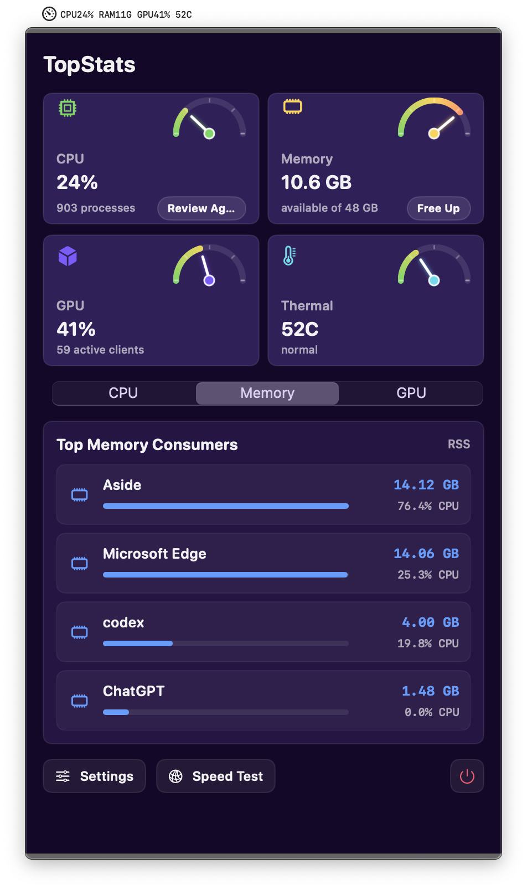
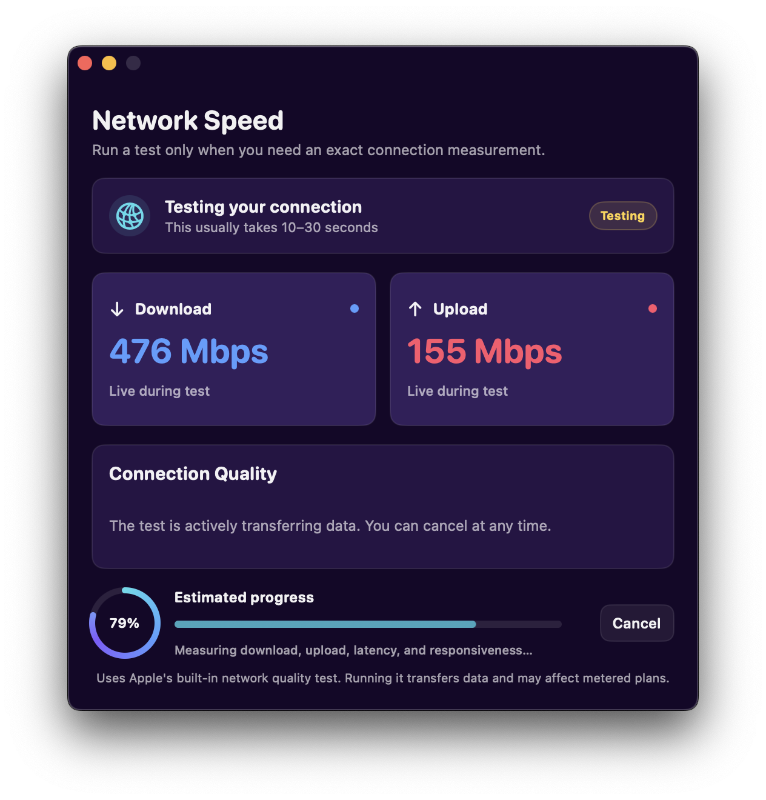

# TopStats

A lightweight menu-bar system monitor for macOS. Displays CPU, RAM, GPU, and temperature directly in the macOS status area, with a dashboard of gauge cards, coding-agent controls, an on-demand network speed test, and top app consumers one click away.



## Features

- **CPU Usage** - real-time processor utilization with process count
- **Top CPU Apps** - grouped per-app CPU consumers from `ps`
- **RAM** - used/available in GB using Activity Monitor's formula (app memory − purgeable + wired + compressed)
- **Top Memory Apps** - grouped per-app RSS consumers from `ps`
- **GPU** - Apple Silicon total GPU utilization percentage
- **GPU Clients** - active apps with AGX GPU client connections from IOKit
- **Temperature** - CPU temperature through the bundled helper, with thermal-state fallback
- **Gauge cards** - each dashboard card has an animated half-circle needle gauge (0% = left, 100% = right) over a green→yellow→red arc
- **Free Up** - CleanMyMac-style RAM reclaim in the Memory tab: briefly applies incompressible memory pressure so the kernel evicts stale pages, then reports the actual gain in available memory (no admin rights needed)
- **On-demand Network Speed Test** - press `Speed Test` to see live download/upload rates, animated estimated progress, and the final capacity, idle latency, and responsiveness result; TopStats performs no passive network monitoring
- **Coding Agents** - review Claude Code, Codex, MCP, and related agent processes with project folders, CPU/RAM, uptime, throttle, and guarded per-PID termination controls



## Requirements

- macOS 13.0 (Ventura) or later
- Apple Silicon (M1/M2/M3) recommended

## Installation

### Option 1: Download Release
Download the latest macOS zip from [Releases](https://github.com/PFCLEEAI/TopStats/releases/latest), extract `TopStats.app`, and move it to `/Applications`.

TopStats is currently ad-hoc signed rather than Apple-notarized. On first launch, macOS may require Control-clicking the app and choosing **Open**.

### Option 2: Build from Source
```bash
# Clone the repo
git clone https://github.com/PFCLEEAI/TopStats.git
cd TopStats

# Build
./build.sh

# Install
rm -rf /Applications/TopStats.app
cp -R TopStats.app /Applications/
open /Applications/TopStats.app
```

## Usage

1. Launch TopStats from Applications
2. The live stats appear in the macOS menu bar/status area (e.g. `CPU 19%  RAM A 6.0G  GPU 17%  52C`)
3. Click the TopStats menu-bar item for the dashboard: gauge cards, top consumers, coding agents, settings, speed test, refresh, and quit
4. Press `Speed Test`, then `Start Test` to measure the current connection. Opening the window alone never starts a test.
5. Settings → Menu Bar toggles which live system metrics appear in the status area

### Auto-start at Login

The app writes and loads a user LaunchAgent at `~/Library/LaunchAgents/com.topstats.app.plist` when "Launch at Login" is enabled in settings. To disable from the terminal:
```bash
launchctl bootout "gui/$(id -u)/com.topstats.app" 2>/dev/null || true
rm -f ~/Library/LaunchAgents/com.topstats.app.plist
```

## Building

```bash
# Compile main app
swiftc -parse-as-library -o TopStats TopStats.swift -framework Cocoa -framework SwiftUI -framework IOKit

# Compile temperature helper
clang -Wall -framework IOKit -framework Foundation -o TempHelper TempHelper.m

# Create app bundle
./build.sh
```

## How It Works

- **CPU**: Uses `host_processor_info` to get accurate CPU load
- **RAM**: Uses `host_statistics64`; used = (internal − purgeable) + wired + compressed, matching Activity Monitor's "Memory Used"
- **GPU**: Reads total GPU utilization and active AGX GPU clients from IOKit
- **Temperature**: Uses the bundled `TempHelper` process to read the calibrated `PMU tcal` sensor on Apple Silicon
- **Network Speed Test**: Runs macOS' built-in `/usr/bin/networkQuality` only after an explicit click and parses its final JSON output. While the test is active, TopStats samples interface byte counters every 400 ms to show approximate live rates; sampling stops with the test. The test uses data and may affect metered plans.

## Tests

```bash
# Offline parser and formatting tests
./tests/run-network-tests.sh

# Optional live integration test (transfers network data)
./tests/run-network-tests.sh --integration
```

## License

MIT License - feel free to use, modify, and distribute.

## Contributing

Pull requests welcome! Please open an issue first to discuss changes.
